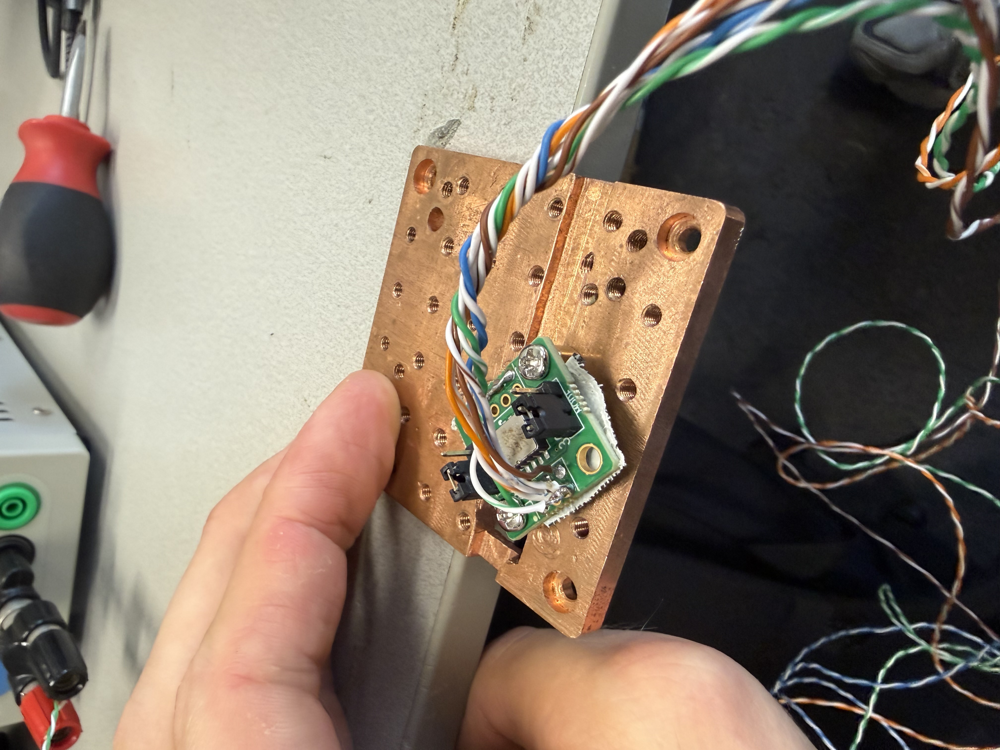
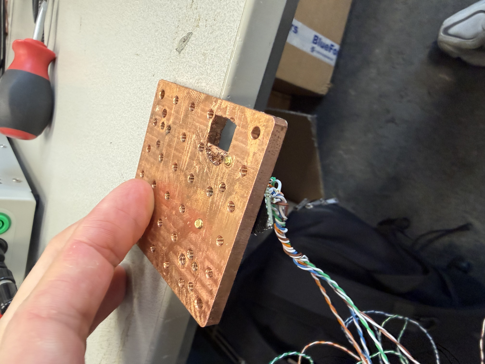

---
numbering:
  equation:
    enumerator: "3.%s"
---
(methods)=
# Experimental Method
In this chapter, the measurement chain and the procedures used to characterise vibrations are described. A static gravity-flip test first validates the ADXL354 accelerometer and the voltage-to-acceleration conversion. A mass-spring ringdown and cryostat-mounted noise spectroscopy then apply the calibrated chain to the systems introduced in the Introduction.

## Measurement setup
The three-axis accelerometer is an ADXL354 (Analog Devices), configured for the $\pm 2\ \mathrm{g}$ full-scale range. Each analog output is ratiometric to the on-chip $1.8\ \mathrm{V}$ analog supply $\mathrm{V_{1P8ANA}}$: the zero-$g$ bias is nominally $\mathrm{V_{1P8ANA}}/2 = 0.9\ \mathrm{V}$, and the datasheet quotes a typical sensitivity of $400\ \mathrm{mV/g}$ at this range[@adxl354_datasheet].

For all measurements reported here, the $x$, $y$, and $z$ outputs are connected to channels 1, 2, and 3 of a Rigol DS1054Z digital oscilloscope. The scope is controlled over Ethernet via PyVISA, and waveforms are transferred to a Python analysis environment. The scope operates in high-resolution acquisition mode with DC coupling. Channel offsets of $-0.9\ \mathrm{V}$ on channels 1 and 2, and $-1.2\ \mathrm{V}$ on channel 3, place the zero-$g$ bias near the centre of the oscilloscope grid, matching the $\mathrm{V_{1P8ANA}}/2$ reference. A vertical scale of $0.1\ \mathrm{V/div}$ is used on all three channels. Deep-memory acquisitions store up to $3 \times 10^6$ points per channel. Recordings are saved as time series of voltage in `.npz` format for offline analysis; the acquisition and analysis notebooks are listed in [](#appendix-code).

### Alternative readout hardware
A Red Pitaya board with PyRPL was available as an alternative readout path. It offers a flexible lock-in style interface but records only two analog inputs per unit. Because simultaneous capture of all three accelerometer axes was required, the Rigol DS1054Z was used for the measurements reported in this thesis.

## Accelerometer validation
Three experiments are performed in sequence. First, sensor sensitivity is determined with a static gravity flip. Second, a mass-spring ringdown on the bench exercises the calibrated chain on a dynamic signal. Third, the same chain is applied to cryostat-mounted recordings for noise spectroscopy. The first two are described below; cryostat acquisition follows in a later section.

### Static flip test for sensitivity calibration
The flip test uses gravity as a known, steady $1\ \mathrm{g}$ acceleration, as described in [](#theory). With the sensor at rest on the bench, the $z$-axis output corresponds to $+1\ \mathrm{g}$. After a manual $180^\circ$ rotation about the $z$-axis, the same axis reads $-1\ \mathrm{g}$. The voltage span between the two plateaus corresponds to $2\ \mathrm{g}$ and defines the sensitivity $S$ in $\mathrm{V/g}$.

For the flip test, the ADXL354 breakout is screwed to a flat copper plate using two spacers so that the sensor package sits level. The plate can be pressed flat against a known-level surface, such as a laboratory desk, in each orientation so that the $z$-axis stays aligned with gravity during the upright and inverted plateaus. The two steady orientations are shown in [](#fig-flip-setup).

```{figure}
:label: fig-flip-setup
:class: grid grid-cols-2 gap-4





Benchtop setup for the static flip calibration. The ADXL354 is mounted on a flat copper plate with two spacers (left: upright, $+1\ \mathrm{g}$ on $z$; right: inverted, $-1\ \mathrm{g}$ on $z$). Scope leads connect the three analog outputs to the Rigol DS1054Z.
```

A $12\ \mathrm{s}$ trace is acquired with the scope settings above while the sensor is held steady upright, flipped, and held steady inverted. Transients during the flip are excluded. The waveform is saved as a timestamped `.npz` file and analysed offline. On the $z$-channel, mean voltages $\bar{V}_{+1\mathrm{g}}$ and $\bar{V}_{-1\mathrm{g}}$ are taken from $1\ \mathrm{s}$ windows in the upright and inverted plateaus ($4$–$5\ \mathrm{s}$ and $9$–$10\ \mathrm{s}$). The zero-$g$ offset is estimated as

$$
\bar{V}_0 = \frac{\bar{V}_{+1\mathrm{g}} + \bar{V}_{-1\mathrm{g}}}{2}
$$

and subtracted from all three channels. After subtraction, the plateau means on $z$ are equal in magnitude and opposite in sign. Because the upright plateau reads higher than the inverted plateau on the raw $z$-trace, the sensitivity is

$$
S = \frac{\bar{V}_{+1\mathrm{g}} - \bar{V}_{-1\mathrm{g}}}{2},
$$ (eq-flip-sensitivity)

with $\bar{V}_{+1\mathrm{g}} > \bar{V}_{-1\mathrm{g}}$. Acceleration in units of $g$ is then obtained from

$$
a_i = \frac{V_i - \bar{V}_0}{S},
$$ (eq-voltage-to-g)

where $V_i$ is the measured voltage on axis $i$. For all recordings after the flip test, the measured $\bar{V}_0$ from [](#results) is used as the fixed offset in [](#eq-voltage-to-g), together with the extracted $S$.

### Mass-spring ringdown
The second experiment uses a vertical mass-spring oscillator of the type described in [](#theory). The ADXL354 is mounted on the oscillating mass. The mass is displaced from equilibrium, released, and the free ringdown is recorded on the Rigol scope while a video camera films the motion. A ruler placed alongside the system provides a length scale in the recording.
During the initial oscillation, the mass travels between approximately $15\ \mathrm{cm}$ and $42\ \mathrm{cm}$ on the ruler. The peak-to-peak span is $27\ \mathrm{cm}$, so the displacement amplitude relative to the midpoint is $A = 13.5\ \mathrm{cm}$. The scope records a single continuous trace of $600\ \mathrm{s}$ at $f_s = 5\ \mathrm{kHz}$ using the settings in the measurement setup above.

The ringdown trace is converted to acceleration using [](#eq-voltage-to-g) with the flip-test sensitivity and $\bar{V}_0$. In parallel, the video is analysed in a chosen time window near the start of the motion. The oscillation frequency $f$ is obtained by counting complete cycles and dividing by the window duration. Peak acceleration from kinematics is computed with [](#eq-shm-peak-accel), using the ruler amplitude $A$ and angular frequency $\omega = 2\pi f$. Because the $z$-axis is aligned with gravity, the expected accelerometer range on $z$ is $1 \pm a_{\mathrm{peak}}/g$ in units of $g$. The kinematic values and the comparison with the accelerometer trace are reported in [](#results).

## Cryostat vibration measurements
The main measurements of this thesis use a DIY dry 4K cryostat at SteeleLab. The cold stage is cooled by a Gifford–McMahon (GM) cryocooler. Two operating conditions are recorded: cooler **off** (baseline) and cooler **on** (running). The ADXL354 is mounted on top of the final cold plate; the plate has no centre mounting holes, so the sensor cannot be placed at the geometric centre of the stage.

The measurement chain matches benchtop validation: three-axis analog outputs into the Rigol scope, with flip-test calibration applied in post-processing via [](#eq-voltage-to-g). 

For each operating condition, the procedure is:

1. Configure the scope as in the measurement setup above and start acquisition with the GM cooler in the desired state (off or on).
2. Allow the system to reach a steady operating state, then stop the scope after a continuous recording window.
3. Read the full deep-memory waveforms for channels 1–3 and save each segment as a timestamped `.npz` file containing arrays `t`, `v_x`, `v_y`, and `v_z`.
4. Repeat step 3 to obtain multiple contiguous segments per condition.

Each segment contains $3 \times 10^6$ samples per channel over approximately $600\ \mathrm{s}$, giving a sample interval $\Delta t = 0.2\ \mathrm{ms}$ and sampling rate $f_s = 5\ \mathrm{kHz}$. The corresponding Nyquist frequency $f_N = f_s/2 = 2.5\ \mathrm{kHz}$ from [](#eq-nyquist) sets the upper limit of the frequency band that can be represented without aliasing in the recorded time series. For spectral analysis, three segments per condition are concatenated in time order to form a single trace of $9 \times 10^6$ samples and total duration $1800\ \mathrm{s}$ ($30\ \mathrm{min}$).

## Signal processing and spectral analysis
Offline analysis converts scope voltages to acceleration using the sensitivity and offset from the flip test, then estimates amplitude spectral density (ASD) spectra.

### Welch ASD
Power spectral densities are estimated with Welch's method (`scipy.signal.welch`) on mean-centred acceleration traces. The segment length sets the trade-off between frequency resolution and smearing of narrow-band lines, as discussed in [](#theory).

Two segment lengths are used:

- **Fine resolution (low-frequency band):** `nperseg = int(60 * fs)` with $f_s = 5\ \mathrm{kHz}$, i.e. $n_{\mathrm{perseg}} = 3 \times 10^5$ samples ($60\ \mathrm{s}$ segments) and $\Delta f \approx 1/60\ \mathrm{Hz} \approx 0.017\ \mathrm{Hz}$.
- **Coarser resolution (extended frequency range):** `nperseg = int(2 * fs)`, i.e. $n_{\mathrm{perseg}} = 10^4$ samples ($2\ \mathrm{s}$ segments).

The ASD is $\mathrm{ASD}(f) = \sqrt{S_{aa}(f)}$, with $S_{aa}$ the one-sided Welch estimate of acceleration PSD in $\mathrm{g}^2/\mathrm{Hz}$. Spectra are plotted in $\mathrm{g}/\sqrt{\mathrm{Hz}}$ on logarithmic axes. Frequency content above $f_N$ is not interpreted, consistent with the sampling limit discussed in [](#theory).

