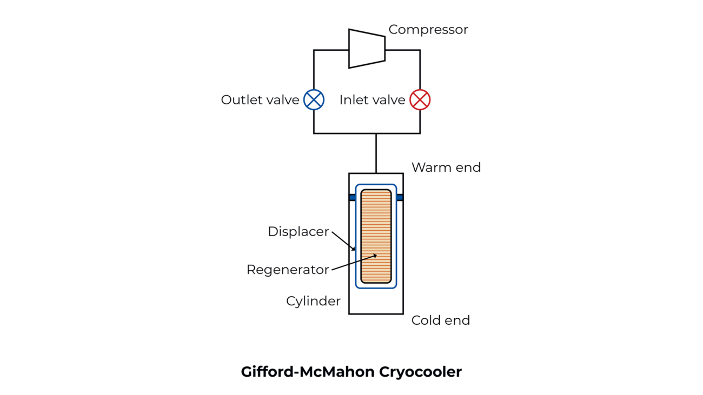
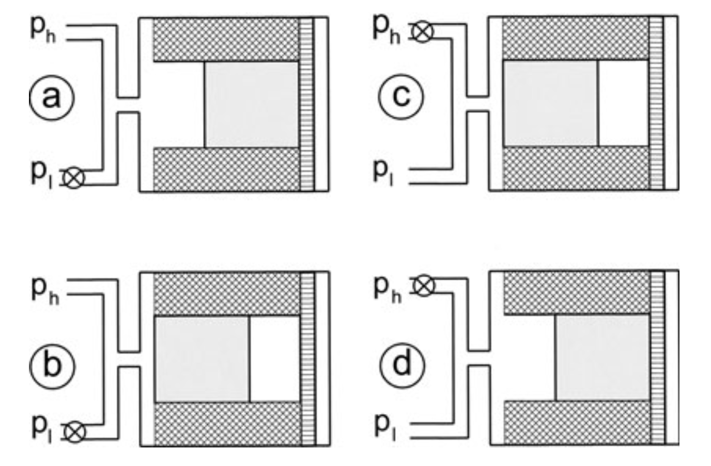

---
numbering:
  equation:
    enumerator: "2.%s"
  figure:
    enumerator: "2.%s"
---
(theory)=
# Theory
This chapter consists of eight sections. First, cryocoolers and cryostat cooling stages are introduced as a source of periodic mechanical vibration. Second, the Gifford–McMahon cryocooler cycle and its drive are examined. Third, the undamped mass-spring oscillator is constructed as the model underlying passive isolation. Fourth, damped motion and ringdown are derived. Fifth, spectral analysis and the response to a repeating drive are developed. Sixth, the mechanical response of extended cryostat structures is contrasted with the single-mode mass-spring isolator. Seventh, the ADXL354 accelerometer response is examined. Lastly, criteria for distinguishing electrical from mechanical vibration are presented.

(cryocoolers-and-cooling-stages)=
## Cryocoolers and cryostat cooling stages
Low-temperature experiments in quantum optomechanics rely on refrigerators that sustain millikelvin environments for long periods without a continuous liquid-helium supply[@steeleLabResearch]. Cryocoolers provide this capability by running a closed thermodynamic cycle: a working fluid, typically helium, is compressed and expanded in a repeating sequence that transports heat from a cold stage inside the cryostat to a warmer reject stage at ambient temperature. The cycle is inherently periodic. Displacers, valves, or remote motors move gas volumes and pistons on each stroke, and that motion couples mechanically into the surrounding frame, thermal links, and vibration-isolation stages.

SteeleLab operates several independent refrigeration systems[@steeleLabResearch]. The main optomechanical experiments run on Bluefors dilution refrigerators, which precool the cryostat with a pulse-tube cryocooler before reaching the sub-kelvin base temperature. Pulse-tube systems separate the compressor from the cold stage and drive periodic gas oscillations along a transfer line. Because the cycle rate is set by the cooler motor and valve timing, the fundamental mechanical drive frequency depends on the installation. Literature on dry cryostats with pulse-tube precooling reports a narrow-band component near $1.4\,\mathrm{Hz}$[@maisonobe2018], and related periodic ticking from helium-pump strokes is described for such systems[@wilkinson2025].

Cooling proceeds through a cascade of thermal stages rather than at a single temperature. At the outer end, the cryocooler cold head rejects heat to room temperature. Inside the cryostat, conduction through copper supports and flexible thermal links connects the 4K plate, intermediate stages such as the 1 K still in dilution systems, and finally the mixing chamber or experimental platform at the lowest temperature. Each stage is a mechanical link through which cooler-induced motion can propagate. Flexible links and passive isolation stages attenuate high-frequency content, but the low-frequency periodic drive of the cryocooler remains a common disturbance across the chain[@wilkinson2025]. [](#fig-bluefors-cryostat) shows the interior of a SteeleLab Bluefors dilution refrigerator with the vacuum can raised, revealing the tiered copper stages, thermal links, and wiring that connect the cold stages.

```{figure} figures/bluefors_cryostat.jpg
:label: fig-bluefors-cryostat
:width: 55%
:align: center

Interior of a SteeleLab Bluefors dilution refrigerator with the vacuum can open. The stacked copper thermal stages, support rods, and cabling between stages are visible; sensitive experiments are mounted at the lowest stage.
```

Sensitive devices are mounted at the lowest accessible stage, on a final cold plate or experimental platform. In SteeleLab, this is where superconducting microwave circuits are combined with high-$Q$ mechanical resonators for optomechanical experiments[@steeleLabResearch]. Residual acceleration at this point sets a floor on how precisely phonon motion can be read out and controlled. The vibration that reaches this final stage is part of that mechanical noise floor.

(gifford-mcmahon-cryocooler-drive)=
## Gifford–McMahon cryocooler drive
SteeleLab also maintains a DIY dry 4K platform cooled by a Gifford–McMahon (GM) cryocooler. In this cycle, helium is the working fluid. The cold head contains compression and expansion volumes, a regenerator, and a displacer that shuttles gas between the warm and cold ends. A remote compressor maintains high- and low-pressure buffer volumes; rotating valves connect the cold head alternately to each side, synchronised with the displacer motion[@atrey2020; @radebaugh2009]. The cold-head cycle typically repeats at $1$--$2\,\mathrm{Hz}$[@atrey2020], and the periodic mechanical disturbance seen at the stage follows that displacer and valve timing. [](#fig-gm-cooler) shows the layout and the four-step cooling cycle.

```{figure}
:label: fig-gm-cooler
:class: grid grid-cols-2 gap-4 grid-gm-cooler

(fig-gm-schematic)=


(fig-gm-cycle)=


Gifford–McMahon cryocooler. a) Operating principle, reproduced from [@bluefors2024gmpt]: a remote compressor drives helium through inlet and outlet valves into the cold head, where a displacer shuttles gas through a regenerator between the warm and cold ends. b) Cooling cycle, reproduced from Figure 14 of [@deWaele2011cryocoolers]: panels $a$–$d$ show the displacer position and the open or closed $p_h$ and $p_l$ valves for one cold-head cycle; expansion in panel $c$ extracts heat at the cold stage.
```

The GM cooling cycle divides into four steps, illustrated in [](#fig-gm-cycle)[@deWaele2011cryocoolers]. Each panel shows the displacer inside a cylinder with a shaded regenerator; high- and low-pressure lines $p_h$ and $p_l$ connect at the warm (left) end, and a valve marked with an $\times$ is closed. The cycle starts in panel $a$ with $p_h$ open, $p_l$ closed, and the displacer at the cold (right) end while high-pressure gas fills the warm volume on the left. From $a$ to $b$, the displacer moves toward the warm end with both valves unchanged; helium is pushed through the regenerator into the volume on the right. From $b$ to $c$, $p_h$ closes, $p_l$ opens, and the displacer stays at the warm end; gas in the cold volume expands toward $p_l$ and absorbs heat from the cold stage. From $c$ to $d$, with $p_l$ still open, the displacer returns toward the cold end and forces the remaining gas back through the regenerator and out through $p_l$. From $d$ to $a$, $p_l$ closes, $p_h$ reopens, and the warm volume is repressurised before the cycle repeats.

Each displacer stroke transmits a brief impulse into the cold-head frame. Next to a running GM cooler one cold-head cycle sounds like thud–thud, pause, thud, pause. The hiss that runs with each thud is high-pressure helium moving through the regenerator and cold-head volumes. Each thud, or thud pair, marks one stroke. On the first stroke the displacer shoots in two steps a few tens of milliseconds apart, which produces the opening thud–thud; a pause follows while the cooler holds or returns more slowly; the later single thud is the reverse stroke; the final pause completes the cycle before it repeats. When an accelerometer is used to measure these vibrations, each thud is recorded as a sharp acceleration spike rather than a smooth sinusoid.

+++{"no-pdf": true}

A recording of the displacer motion ([](#fig-gm-cooler-action); excerpt from [@hyperspacePirate2026gm]) and an audio clip ([](#audio-gm-heartbeat)) illustrate the thud–thud, pause, thud, pause pattern below. The audio was recorded next to the running GM cooler during this project and has been slowed down by half so the sequence is easier to hear.

```{figure} assets/awt886.gif
:label: fig-gm-cooler-action
:enumerated: false
:width: 70%
:align: center

GM cooler displacer motion during operation[@hyperspacePirate2026gm]. Each reciprocating stroke matches one thud or thud pair in the audio below.
```

```{figure} assets/IMG_3871.mp3
:label: audio-gm-heartbeat
:enumerated: false

Recording of one GM cold-head cycle (thud–thud, pause, thud, pause), recorded next to the running GM cooler and slowed down by half.
```

+++

The GM cooler therefore presents a repeating mechanical disturbance at the cold stage. Reducing how much of that drive reaches a sensitive experiment is the role of passive vibration isolation, which is modelled with a mass-spring oscillator.

(mass-spring-oscillator)=
## The undamped mass-spring oscillator
Passive vibration isolation reduces motion transmitted from a narrow-band disturbance to sensitive instrumentation by suspending a platform on springs so that its resonance lies away from the drive[@wilkinson2025]. Such an isolator is a designed oscillator with known natural frequency $f_0$ and damping rate $\Gamma_m$. Isolation is therefore analysed with a single-mode mass-spring model.

Consider a mass $m$ attached to a spring with stiffness $k$. When the displacement $x$ from equilibrium is small, Hooke's law gives a restoring force $F = -kx$. Then Newton's second law can be used to yield the equation of motion

$$
m\ddot{x} = - kx
$$ (eq-undamped-eom)

where $\ddot{x}$ denotes the second derivative of displacement w.r.t. time. This describes a simple harmonic oscillator. The general solution reads

$$
x(t) = A\cos(\omega_0 t + \varphi),
$$ 
where $A$ is the oscillation amplitude, $\varphi$ is a phase set by the initial conditions, and

$$
\omega_0 = \sqrt{\frac{k}{m}}
$$ (eq-natural-frequency)

is the natural angular frequency. Or equivalently, $f_0 = \frac{\omega_0}{2\pi}$. 

When the mass is suspended from a spring vertically, its weight stretches the spring until the upward spring force balances gravity. Let $\Delta L$ denote how much longer the spring is at this equilibrium position than when it is unloaded. Force balance then gives $k\Delta L = mg$, where $g$ is the gravitational acceleration. Then the spring constant can be obtained using

$$
k = \frac{mg}{\Delta L}.
$$ 

Measuring $\Delta L$ for a specific mass $m$ therefore provides an independent estimate of $k$, and hence of the natural frequency

$$
f_0 = \frac{1}{2\pi}\sqrt{\frac{g}{\Delta L}}.
$$

For simple harmonic motion at angular frequency $\omega_0$ with peak displacement amplitude $A$, the peak acceleration is $a_{\mathrm{peak}} = \omega_0^2 A$. In units of $g$,

$$
\frac{a_{\mathrm{peak}}}{g} = \frac{(2\pi f_0)^2 A}{g},
$$ (eq-shm-peak-accel)

where $A$ is in metres. The same relation links displacement and acceleration whenever motion is dominated by a single harmonic at $f_0$. Mass-spring isolation at an experimental platform is typically designed so that $f_0$ of the isolator avoids the dominant cooler line[@wilkinson2025]. Real oscillators also dissipate energy.

## Damped motion and ringdown
### Equation of motion
Because energy is lost during oscillation, a dissipative force proportional to velocity is added to the model. This viscous damping force points opposite to the motion and reads

$$
F_d = -c\dot{x},
$$ 

with damping coefficient $c$ in $[Ns/m]$. Combining the spring and damping forces with Newton's second law gives

$$
m\ddot{x} + c\dot{x} + kx = 0.
$$ (eq-damped-eom)

It is convenient to write this in terms of the mass-normalised damping rate

$$
\Gamma_m = \frac{c}{m},
$$ (eq-gamma-definition)

where $\Gamma_m$ has units of $Hz$. Substituting [](#eq-gamma-definition) into [](#eq-damped-eom) yields

$$
\ddot{x} + \Gamma_m \dot{x} + \omega_0^2 x = 0.
$$ (eq-damped-normalised)

For the lightly damped regime ($\Gamma_m \ll \omega_0$), the solution is an exponentially decaying sinusoid:

$$
x(t) = Ae^{-\Gamma_m t/2}\cos(\tilde{\omega}_0 t + \varphi),
$$ (eq-ringdown-solution)

with damped angular frequency $\tilde{\omega}_0 = \omega_0 \sqrt{1 - (\Gamma_m/2\omega_0)^2}$. The envelope $A(t) = A_0 e^{-\Gamma_m t/2}$ decays exponentially in time. The full derivation of [](#eq-ringdown-solution) can be found in [](#appendix-derivations).

(ringdown-protocol)=
### Ringdown protocol
A ringdown measurement probes the free evolution described by [](#eq-ringdown-solution). The system is displaced from equilibrium, released, and the acceleration or displacement is recorded as the motion decays in the absence of an external drive. This protocol has been used to extract $\Gamma_m$ from cryogenic mass-spring isolation prototypes[@wilkinson2025].

The damping rate follows from fitting the amplitude envelope to

$$
A(t) = A_0 e^{-\Gamma_m t/2}.
$$ (eq-envelope-fit)

Intuitively, a smaller $\Gamma_m$ implies a slower decay, whereas a larger $\Gamma_m$ implies faster energy dissipation. For a given $f_0$, the envelope sets the time scale on which stored mechanical energy is lost, independent of whether the oscillator is a laboratory spring or a cryogenic isolator.

(amplitude-dependent-damping)=
### Amplitude-dependent damping
The viscous model above assumes a damping force linear in velocity with a constant coefficient $c$, so the envelope in [](#eq-ringdown-solution) decays at a fixed rate $\Gamma_m$. Real oscillators often deviate from this limit. On a benchtop mass-spring assembly, dry friction at the spring supports and velocity-dependent air drag both dissipate more energy at larger amplitude. The effective damping rate is then higher early in a ringdown, when the displacement is large, and falls as the motion decays. A single exponential fit to the peak envelope, as in [](#eq-envelope-fit), can therefore track the late-time decay while undershooting the initial interval. A constant-$\Gamma_m$ picture is only a qualitative guide for validation; extracting one $\Gamma_m$ from the full trace is meaningful only when the amplitude-dependent contribution is small.

Free ringdown characterises $\Gamma_m$ in the absence of an external drive. An operating cryostat, by contrast, is continuously driven by the cooler cycle, so the relevant description shifts from free decay to the frequency content of a steady drive.

(spectral-analysis)=
## Spectral analysis and periodic forcing
### Power spectral density and amplitude spectral density
Cryostat vibration measurements are analysed in the frequency domain. For a stationary acceleration signal $a(t)$, the one-sided power spectral density $S_{aa}(f)$ describes how mean-square acceleration is distributed over frequency. The variance follows from integrating over all frequencies,

$$
\sigma_a^2 = \int_0^\infty S_{aa}(f)\,\mathrm{d}f.
$$ (eq-variance-psd)

The Amplitude Spectral Density (ASD) is then defined as

$$
\mathrm{ASD}(f) = \sqrt{S_{aa}(f)}.
$$

Manufacturers often quote accelerometer noise floors in ASD units, typically $\mu\mathrm{g}/\sqrt{\mathrm{Hz}}$, which allows direct comparison with measured vibration spectra.

Welch's method[@welch1967] estimates $S_{aa}(f)$ by averaging periodograms computed on overlapping time segments. The segment length sets a trade-off between frequency resolution and the smearing of narrow-band lines. A long segment resolves closely spaced peaks but leaves a sharp periodic drive, such as a pulse-tube cryocooler fundamental near $1.4\,\mathrm{Hz}$[@maisonobe2018], visible as a comb of lines. A shorter segment broadens those lines and exposes the broader mechanical structure underneath.

When successive recordings are separated by gaps and later concatenated for analysis, the joins break phase continuity across the full time series. For a coherent, phase-locked tone this can matter. For an incoherent spectrum, where the quantities of interest are averaged power levels rather than a preserved phase relation between acquisitions, short breaks between recordings do not change the Welch estimate of $S_{aa}(f)$.

(sampling-nyquist)=
### Sampling and the Nyquist limit
Digital acquisition records a continuous acceleration signal at discrete times separated by $\Delta t = 1/f_s$, where $f_s$ is the sampling rate. The highest frequency that can be represented unambiguously from such samples is the Nyquist frequency[@shannon1949communication]

$$
f_N = \frac{f_s}{2}.
$$ (eq-nyquist)

According to the Nyquist–Shannon sampling theorem, all frequency content in a band-limited signal below $f_N$ can in principle be recovered from the sampled values. Spectral components above $f_N$ are not captured at their true frequency. They fold back into the interval $[0, f_N]$, a process known as aliasing, and can be mistaken for low-frequency vibration.

Aliasing is suppressed in practice by band-limiting the signal before digitisation. The ADXL354 includes an on-chip anti-aliasing filter as part of its analogue front end[@adxl354_datasheet]. The oscilloscope and analysis chain impose a further upper limit set by $f_s$. Welch estimates of $S_{aa}(f)$ are therefore only meaningful for frequencies below $f_N$; at higher frequencies the discrete spectrum does not reflect the true mechanical content.

For vibration measurements aimed at cryocooler fundamentals and low-order harmonics, $f_s$ is typically chosen well above the frequencies of interest so that $f_N$ leaves margin for higher harmonics and structural resonances. When $f_N$ lies near a sensor resonance or within the plotted frequency range, features close to that limit may reflect the acquisition and sensor transfer function as much as the structure under test.

(driven-oscillator)=
### Driven oscillator and harmonic content
Mechanical structures in an operating cryostat are continuously driven by the periodic cryocooler cycle rather than ringing down freely[@atrey2020; @radebaugh2009]. For a single mode driven harmonically at angular frequency $\omega$, the steady-state equation of motion reads

$$
m\ddot{x} + c\dot{x} + kx = F_0 \cos(\omega t).
$$ (eq-driven-eom)

The resulting displacement amplitude as a function of drive frequency is[@fowles2005]

$$
X(\omega) = \frac{F_0}{k - m\omega^2 + ic\omega}.
$$ (eq-transfer-function)

The magnitude $|X(\omega)|$ exhibits a maximum near $\omega = \omega_0$. This single-mode picture is a building block for reading spectra from a more complicated structure: when many resonances are present, each can contribute a peak in $S_{aa}(f)$ at its own frequency. The peak width reflects damping: for small damping the full width at half maximum $\Delta f$ is related to $\Gamma_m$ by $\Gamma_m = 2\pi \Delta f$.

The cryocooler drive is not a pure sinusoid. A periodic displacement or force that repeats once per cycle but has a pulse-like waveform contains energy at the fundamental frequency and at integer harmonics. A vibration spectrum therefore shows a comb of lines spaced by the drive frequency, together with additional peaks from structural resonances excited by that drive. Harmonics can extend to frequencies well above the fundamental.

The single-mode driven oscillator is only a building block. A cryostat cold plate is not a designed mass-spring isolator: it supports many modes at once.

(mechanical-response-of-extended-structures)=
## Mechanical response of extended structures
A cryostat plate or stage couples many degrees of freedom at once. Plates, copper supports, hoses, and internal components form an extended elastic structure with many normal modes. Each mode has a characteristic frequency and a mode shape: a pattern of displacement across the structure at which motion is amplified for a given drive frequency.

When the structure is excited at or near a mode frequency, the acceleration at a particular point depends on how that mode shape couples to each sensitive axis. A mode that produces primarily vertical motion is seen most clearly on the axis aligned with that direction, whereas a mode that mixes several directions can appear on more than one channel with different relative amplitudes. Sensor placement relative to symmetry points of the structure therefore affects the relative strength of peaks on different axes.

The vibration spectrum at any mount point is the cryocooler drive spectrum filtered by this mechanical response and by the sensor orientation. Cooler-induced harmonics and structural resonances need not appear with the same strength on all three channels. Individual spectral peaks generally cannot be assigned to specific components without further modal information. A lumped mass-spring isolator is characterised by $f_0$ and $\Gamma_m$; a distributed cold plate presents a dense or irregular set of modes driven by the same periodic source. Spectra of that drive are only useful if the accelerometer response in the band of interest is known.

(adxl354-accelerometer)=
## The ADXL354 accelerometer
Low-frequency vibration measurements can be done with an accelerometer that has a stable bias, low noise density, and a flat response over the band of interest. The ADXL354 is a MEMS accelerometer with analog outputs and a typical sensitivity of $400\,\mathrm{mV/g}$ at the $\pm 2\,\mathrm{g}$ full-scale range[@adxl354_datasheet]. Each output is ratiometric to the on-chip $1.8\,\mathrm{V}$ supply $\mathrm{V_{1P8ANA}}$, with a zero-$g$ bias nominally at $\mathrm{V_{1P8ANA}}/2$.

At rest, the sensor measures the local gravitational field. For an axis aligned with gravity, one orientation gives $+1\,\mathrm{g}$ and a $180^\circ$ rotation about that axis gives $-1\,\mathrm{g}$. The output voltages at the two plateaus therefore differ by a span equivalent to $2\,\mathrm{g}$. Dividing that span by $2\,\mathrm{g}$ yields a sensitivity in $\mathrm{V/g}$ that can be compared with the datasheet value without a separate reference accelerometer. Because the outputs are ratiometric to $\mathrm{V_{1P8ANA}}$, the midpoint between the two plateaus estimates the zero-$g$ bias for that recording.

The sensor does not respond uniformly at all frequencies. Analog Devices publishes measured transfer functions for each axis[@adxl354_datasheet], reproduced in [](#fig-adxl354-transfer). Each curve shows relative output in units of $g$ per $g$ of input acceleration as a function of frequency, including the effect of the on-chip anti-aliasing filter discussed in [](#sampling-nyquist). Below roughly $1\,\mathrm{kHz}$ the response is flat near unity, so the nominal sensitivity applies across the low-frequency band of interest. Above this band an internal mechanical resonance appears near $2.5\,\mathrm{kHz}$ on all three axes. The peak height is axis-dependent: the $x$- and $y$-channels show the largest gain, whereas the $z$-channel resonance is weaker. Peaks in measured spectra near this resonance may therefore reflect the sensor transfer function as much as the cryostat structure, and should be interpreted accordingly.

```{figure}
:label: fig-adxl354-transfer
:class: grid grid-cols-3 items-end gap-4

(fig-adxl354-x-response)=


(fig-adxl354-y-response)=


(fig-adxl354-z-response)=


ADXL354 frequency response for the $x$-, $y$-, and $z$-axes, reproduced from datasheet Figures 8–10 of [@adxl354_datasheet]. Relative output is flat near $1\,\mathrm{g/g}$ below $\sim 1\,\mathrm{kHz}$ on all axes. A mechanical resonance near $2.5\,\mathrm{kHz}$ is present on each axis; peak gain is highest on $x$ and $y$ and lower on $z$.
```

The datasheet also specifies a typical noise density of order $22.5 \mu\mathrm{g}/\sqrt{\mathrm{Hz}}$[@adxl354_datasheet]. Readout electronics can raise the measured broadband floor above that value. At low frequencies the ASD often rises as $1/f$ (flicker) from the sensor or from other electronics in the chain, including the oscilloscope. At the $\pm 2\,\mathrm{g}$ range, the linear output swing is limited to roughly $\pm 0.8\,\mathrm{V}$ about the zero-$g$ bias for the typical sensitivity, so accelerations beyond that range will clip.

Measured spectra mix mechanical motion of the structure, the sensor transfer function, and electrical pickup in the readout chain.

(distinguishing-electrical-from-mechanical-vibration)=
## Distinguishing electrical from mechanical vibration
Not every feature in a vibration spectrum originates from mechanical motion of the structure under test. Electrical interference at the mains frequency (Europe: $50\,\mathrm{Hz}$) and its harmonics, ground loops, and noise from the readout chain can all appear in the recorded voltage signals.

A useful discrimination criterion is channel correlation. If a narrow-band feature appears at the same frequency on all three axes with similar shape and a comparable amplitude scale, it is likely dominated by electrical pickup common to the measurement chain. Examples include lines near $50\,\mathrm{Hz}$ (mains frequency) and its harmonics, and broad elevated regions that track the same spectral shape on every channel.

Mechanical motion of an extended structure, by contrast, generally produces axis-dependent spectra. Comparing measurements taken with the cryocooler off and on helps separate a common-mode electrical floor from additional lines and broadband elevation associated with cooler operation. Features that grow strongly when the drive is active and differ markedly between axes are more likely to have a mechanical origin.

It should be noted that this criterion identifies a likely origin rather than a unique source. Residual mixing between mechanical and electrical paths, and harmonics from nonlinearities in the detection chain, can blur that assignment. Features are classified as electrical or mechanical only when the channel pattern and the cooler off/on comparison give clear evidence.
