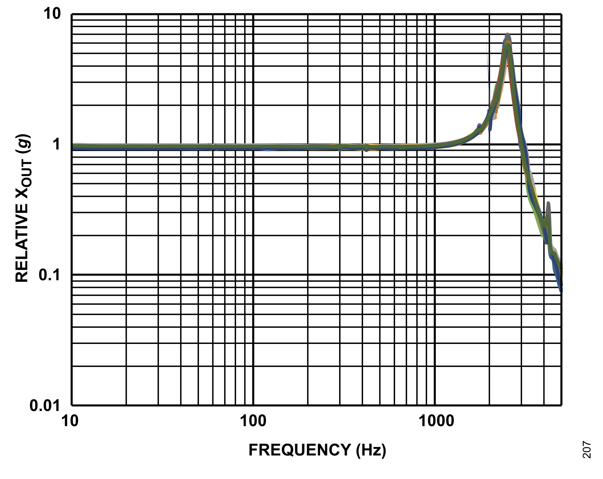
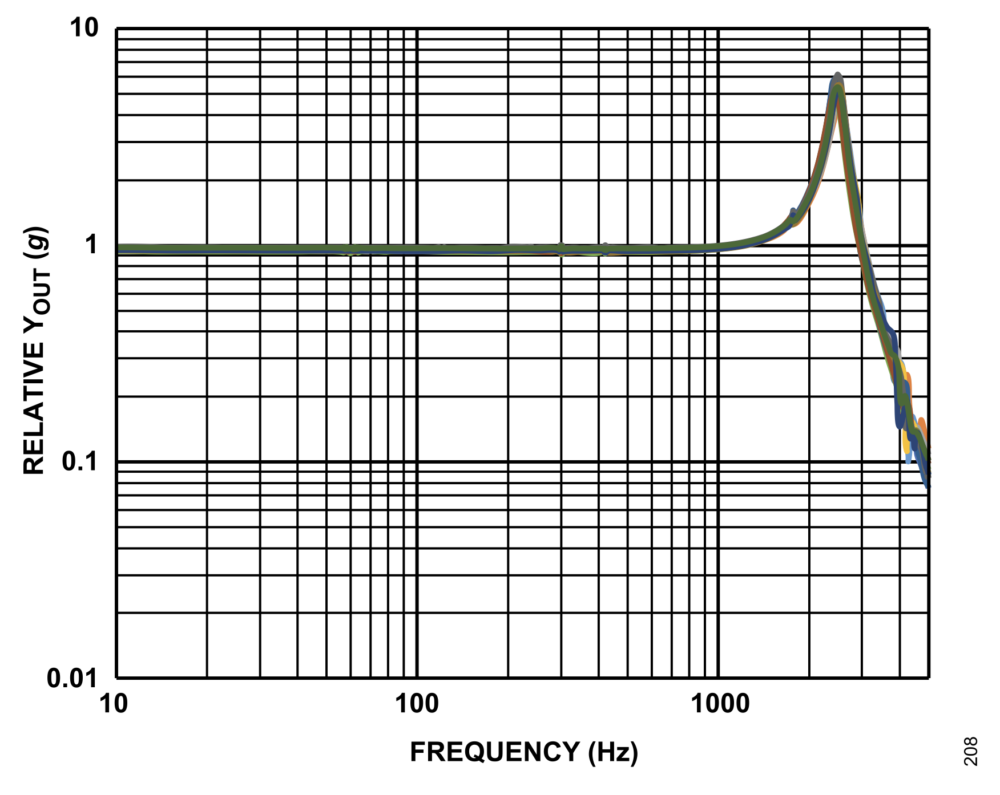
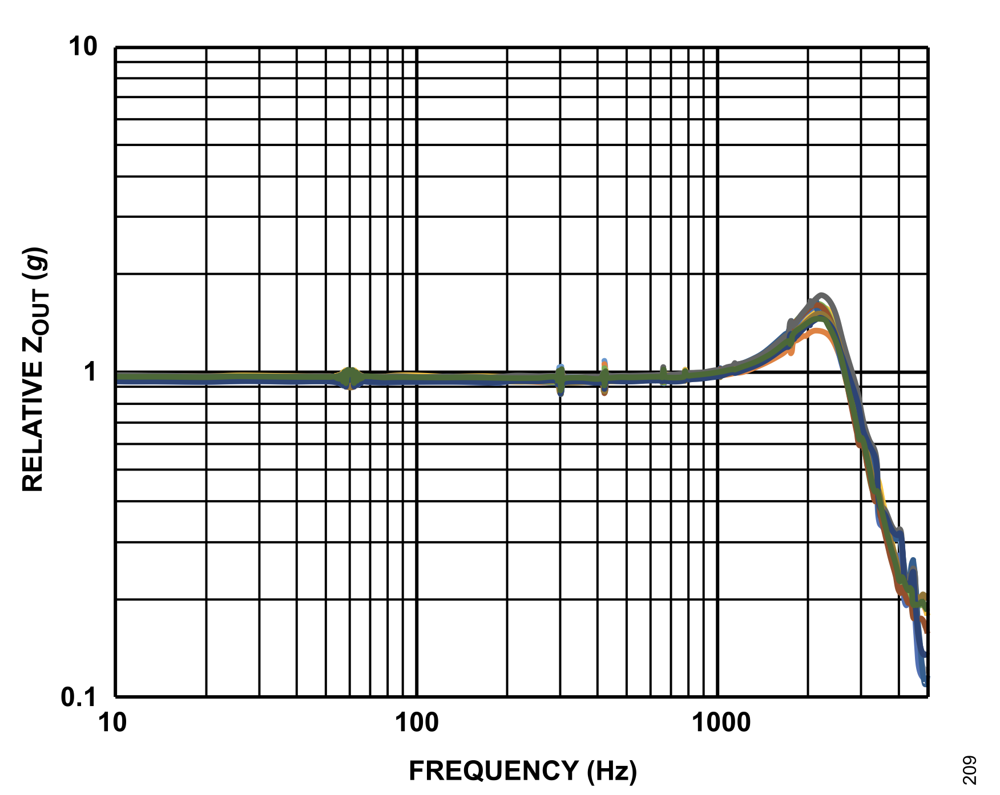

---
numbering:
  equation:
    enumerator: "2.%s"
---
(theory)=
# Theory
(mass-spring-oscillator)=
## The undamped mass-spring oscillator
Consider a mass $m$ attached to a spring with stiffness $k$. When the displacement $x$ from equilibrium is small, Hooke's law gives a restoring force $F = -kx$. Then Newton's second law can be used to yield the equation of motion

$$
m\ddot{x} = - kx
$$ (eq-undamped-eom)

where $\ddot{x}$ denotes the second derivative of discplacement w.r.t. time. This describes a simple harmonic oscillator. The general solution reads

$$
x(t) = A\cos(\omega_0 t + \varphi),
$$ 
where $A$ is the oscillation amplitude, $\varphi$ is a phase set by the initial conditions, and

$$
\omega_0 = \sqrt{\frac{k}{m}}
$$ (eq-natural-frequency)

is the natural angular frequency. Or equivalently, $f_0 = \frac{\omega_0}{2\pi}$. 

When the mass hangs from a vertical spring, its weight stretches the spring until the upward spring force balances gravity. Let $\Delta L$ denote how much longer the spring is at this equilibrium position than when it is unloaded. Force balance then gives $k\Delta L = mg$, where $g$ is the gravitational acceleration. Then the spring constant can be obtained using

$$
k = \frac{mg}{\Delta L}.
$$ 

Measuring $\Delta L$ for a specific mass $m$ therefore provides an independent estimate of $k$, and hence of the natural frequency

$$
f_0 = \frac{1}{2\pi}\sqrt{\frac{g}{\Delta L}}.
$$

For simple harmonic motion at angular frequency $\omega_0$ with peak displacement amplitude $A$, the peak acceleration is $a_{\mathrm{peak}} = \omega_0^2 A$. In units of $g$,

$$
\frac{a_{\mathrm{peak}}}{g} = \frac{(2\pi f_0)^2 A}{g},
$$ (eq-shm-peak-accel)

where $A$ is in metres. The same relation links displacement and acceleration whenever motion is dominated by a single harmonic at $f_0$.

Passive vibration isolation exploits the same mass-spring picture. A platform suspended on springs can be tuned so that its resonance lies away from a narrow-band disturbance, reducing motion transmitted to sensitive instrumentation[@wilkinson2025]. Such an isolator is a designed oscillator with known $f_0$ and $\Gamma_m$. A cryostat structure, by contrast, supports many modes simultaneously; that richer frequency content is discussed in a later section.

## Damped motion and Ringdown
### Equation of motion
Because energy is lost during oscillation, a dissipative force proportional to velocity is added to the model. This viscous damping force points opposite to the motion and reads

$$
F_d = -c\dot{x},
$$ 

with damping coefficient $c$ in $[Ns/m]$. Combining the spring and damping forces with Newton's second law gives

$$
m\ddot{x} + c\dot{x} + kx = 0.
$$ (eq-damped-eom)

It is convenient to write this in terms of the mass-normalised damping rate

$$
\Gamma_m = \frac{c}{m},
$$ (eq-gamma-definition)

where $\Gamma_m$ has units of $Hz$. Substituting [](#eq-gamma-definition) into [](#eq-damped-eom) yields

$$
\ddot{x} + \Gamma_m \dot{x} + \omega_0^2 x = 0.
$$ (eq-damped-normalised)

For the lightly damped regime ($\Gamma_m \ll \omega_0$), the solution is an exponentially decaying sinusoid:

$$
x(t) = Ae^{-\Gamma_m t/2}\cos(\tilde{\omega}_0 t + \varphi),
$$ (eq-ringdown-solution)

with damped angular frequency $\tilde{\omega}_0 = \omega_0 \sqrt{1 - (\Gamma_m/2\omega_0)^2}$. The envelope $A(t) = A_0 e^{-\Gamma_m t/2}$ decays exponentially in time. The full derivation of [](#eq-ringdown-solution) can be found in [](#appendix-derivations).

(ringdown-protocol)=
### Ringdown protocol
A ringdown measurement probes the free evolution described by [](#eq-ringdown-solution). The system is displaced from equilibrium, released, and the acceleration or displacement is recorded as the motion decays in the absence of an external drive. Wilkinson[@wilkinson2025] used this protocol to extract $\Gamma_m$ from cryogenic mass-spring isolation prototypes.

The damping rate follows from fitting the amplitude envelope to

$$
A(t) = A_0 e^{-\Gamma_m t/2}.
$$ (eq-envelope-fit)

Intuitively, a smaller $\Gamma_m$ implies a slower decay, whereas a larger $\Gamma_m$ implies faster energy dissipation. For a given $f_0$, the envelope sets the time scale on which stored mechanical energy is lost, independent of whether the oscillator is a laboratory spring or a cryogenic isolator.

(spectral-analysis)=
## Spectral analysis and periodic forcing
### Power spectral density and amplitude spectral density
Cryostat vibration measurements are analysed in the frequency domain. For a stationary acceleration signal $a(t)$, the one-sided power spectral density $S_{aa}(f)$ describes how mean-square acceleration is distributed over frequency. The variance follows from integrating over all frequencies,

$$
\sigma_a^2 = \int_0^\infty S_{aa}(f)\ \mathrm{d}f.
$$ (eq-variance-psd)

The Amplitude Spectral Density (ASD) is defined as

$$
\mathrm{ASD}(f) = \sqrt{S_{aa}(f)}.
$$

Manufacturers often quote accelerometer noise floors in ASD units, typically $\mu\mathrm{g}/\sqrt{\mathrm{Hz}}$, which allows direct comparison with measured vibration spectra.

Welch's method estimates $S_{aa}(f)$ by averaging periodograms computed on overlapping time segments. The segment length sets a trade-off between frequency resolution and the smearing of narrow-band lines. A long segment resolves closely spaced peaks but leaves a sharp periodic drive, such as a cryocooler fundamental near $1.4\ \mathrm{Hz}$[@maisonobe2018], visible as a comb of lines. A shorter segment broadens those lines and exposes the broader mechanical structure underneath.

(sampling-nyquist)=
### Sampling and the Nyquist limit
Digital acquisition records a continuous acceleration signal at discrete times separated by $\Delta t = 1/f_s$, where $f_s$ is the sampling rate. The highest frequency that can be represented unambiguously from such samples is the Nyquist frequency[@shannon1949communication]

$$
f_N = \frac{f_s}{2}.
$$ (eq-nyquist)

According to the Nyquist–Shannon sampling theorem, all frequency content in a band-limited signal below $f_N$ can in principle be recovered from the sampled values. Conversely, spectral components above $f_N$ are not captured at their true frequency. They fold back into the interval $[0, f_N]$, a process known as aliasing, and can be mistaken for low-frequency vibration.

Aliasing is suppressed in practice by band-limiting the signal before digitisation. The ADXL354 includes an on-chip anti-aliasing filter as part of its analogue front end[@adxl354_datasheet]. The oscilloscope and analysis chain impose a further upper limit set by $f_s$. Welch estimates of $S_{aa}(f)$ are therefore only meaningful for frequencies below $f_N$; at higher frequencies the discrete spectrum does not reflect the true mechanical content.

For vibration measurements aimed at cryocooler fundamentals and low-order harmonics, $f_s$ is typically chosen well above the frequencies of interest so that $f_N$ leaves margin for higher harmonics and structural resonances. When $f_N$ lies near a sensor resonance or within the plotted frequency range, features close to that limit may reflect the acquisition and sensor transfer function as much as the structure under test.

(driven-oscillator)=
### Driven oscillator and harmonic content
Mechanical structures in an operating cryostat are continuously driven by the periodic cryocooler cycle rather than ringing down freely[@maisonobe2018]. For a single mode driven harmonically at angular frequency $\omega$, the steady-state equation of motion reads

$$
m\ddot{x} + c\dot{x} + kx = F_0 \cos(\omega t).
$$ (eq-driven-eom)

The resulting displacement amplitude as a function of drive frequency is[@fowles2005]

$$
X(\omega) = \frac{F_0}{k - m\omega^2 + ic\omega}.
$$ (eq-transfer-function)

The magnitude $|X(\omega)|$ exhibits a maximum near $\omega = \omega_0$. This single-mode picture is a building block for reading spectra from a more complicated structure: when many resonances are present, each can contribute a peak in $S_{aa}(f)$ at its own frequency. The peak width reflects damping: for small damping the full width at half maximum $\Delta f$ is related to $\Gamma_m$ by $\Gamma_m = 2\pi \Delta f$.

The cryocooler drive is not a pure sinusoid. A periodic displacement or force that repeats once per cycle but has a pulse-like waveform contains energy at the fundamental frequency and at integer harmonics. A vibration spectrum therefore shows a comb of lines spaced by the drive frequency, together with additional peaks from structural resonances excited by that drive. Harmonics can extend to frequencies well above the fundamental.

## Gifford–McMahon cryocooler drive
Dry cryostats are commonly cooled by a Gifford–McMahon (GM) cryocooler. In this cycle, a displacer moves helium gas between hot and cold volumes. The motion compresses and expands the gas in steps, transferring heat out of the cold stage. Each cycle imposes a periodic mechanical disturbance on the surrounding structure.

In the time domain the disturbance appears as a repeated pattern of accelerations rather than a smooth sinusoid. A fast displacement stroke followed by a slower return produces a characteristic tick-back-tick sequence, sometimes with a double peak within one half-cycle when the internal valve and displacer motion are offset in time.

Literature on dry cryostats reports a narrow-band mechanical component near $1.4\ \mathrm{Hz}$ from cryocooler operation, together with low-frequency harmonics[@maisonobe2018]. Wilkinson[@wilkinson2025] describes a related periodic ticking from helium-pump strokes in a pulse-tube system. The absolute drive frequency depends on the cooler motor speed and duty cycle. The important point for spectral interpretation is that the drive is narrow-band and periodic, so its signature is a fundamental plus harmonics rather than a flat broadband floor. Mass-spring isolation at the experimental platform is typically designed so that $f_0$ of the isolator avoids this line[@wilkinson2025].

(adxl354-accelerometer)=
## The ADXL354 accelerometer
Low-frequency vibration measurements require an accelerometer with a stable bias, low noise density, and a flat response over the band of interest. The ADXL354 is a MEMS accelerometer with analog outputs and a typical sensitivity of $400\ \mathrm{mV/g}$ at the $\pm 2\ \mathrm{g}$ full-scale range[@adxl354_datasheet]. Each output is ratiometric to the on-chip $1.8\ \mathrm{V}$ supply $\mathrm{V_{1P8ANA}}$, with a zero-$g$ bias nominally at $\mathrm{V_{1P8ANA}}/2$.

At rest, the sensor measures the local gravitational field. For an axis aligned with gravity, one orientation gives $+1\ \mathrm{g}$ and a $180^\circ$ rotation about that axis gives $-1\ \mathrm{g}$. The output voltages at the two plateaus therefore differ by a span equivalent to $2\ \mathrm{g}$. Dividing that span by $2\ \mathrm{g}$ yields a sensitivity in $\mathrm{V/g}$ that can be compared with the datasheet value without a separate reference accelerometer. Because the outputs are ratiometric to $\mathrm{V_{1P8ANA}}$, the midpoint between the two plateaus estimates the zero-$g$ bias for that recording.

The sensor does not respond uniformly at all frequencies. Analog Devices publishes measured transfer functions for each axis[@adxl354_datasheet], reproduced in [](#fig-adxl354-transfer). Each curve shows relative output in units of $g$ per $g$ of input acceleration as a function of frequency, including the effect of the on-chip anti-aliasing filter. Below roughly $1\ \mathrm{kHz}$ the response is flat near unity, so the nominal sensitivity applies across the low-frequency band of interest. Above this band an internal mechanical resonance appears near $2.5\ \mathrm{kHz}$ on all three axes. The peak height is axis-dependent: the $x$- and $y$-channels show the largest gain, whereas the $z$-channel resonance is weaker. Peaks in measured spectra near this resonance may therefore reflect the sensor transfer function as much as the cryostat structure, and should be interpreted accordingly.

```{figure}
:label: fig-adxl354-transfer
:class: grid grid-cols-3 items-end gap-4

(fig-adxl354-x-response)=


(fig-adxl354-y-response)=


(fig-adxl354-z-response)=


ADXL354 frequency response for the $x$-, $y$-, and $z$-axes (datasheet Figures 8–10)[@adxl354_datasheet]. Relative output is flat near $1\ \mathrm{g/g}$ below $\sim 1\ \mathrm{kHz}$ on all axes. A mechanical resonance near $2.5\ \mathrm{kHz}$ is present on each axis; peak gain is highest on $x$ and $y$ and lower on $z$.
```

The datasheet specifies a typical noise density of order $22.5 \mu\mathrm{g}/\sqrt{\mathrm{Hz}}$. The total noise floor seen in a measurement can exceed this value if the readout electronics contribute additional broadband noise. At the $\pm 2\ \mathrm{g}$ range, the linear output swing is limited to roughly $\pm 0.8\ \mathrm{V}$ about the zero-$g$ bias for the typical sensitivity, defining the maximum acceleration that can be recorded without clipping.

## Mechanical response of extended structures
The models above each describe a single degree of freedom. A cryostat plate or stage couples many such freedoms at once: plates, copper supports, hoses, and internal components form an extended elastic structure with many normal modes. Each mode has a characteristic frequency and a mode shape: a pattern of displacement across the structure at which motion is amplified for a given drive frequency.

When the structure is excited at or near a mode frequency, the acceleration at a particular point depends on how that mode shape couples to each sensitive axis. A mode that produces primarily vertical motion is seen most clearly on the axis aligned with that direction, whereas a mode that mixes several directions can appear on more than one channel with different relative amplitudes. Sensor placement relative to symmetry points of the structure therefore affects the relative strength of peaks on different axes.

The vibration spectrum at any mount point is the cryocooler drive spectrum filtered by this mechanical response and by the sensor orientation. Cooler-induced harmonics and structural resonances need not appear with the same strength on all three channels. Individual spectral peaks generally cannot be assigned to specific components without further modal information. This distinction between a lumped mass-spring isolator and a distributed structure is essential: the former is characterised by $f_0$ and $\Gamma_m$, whereas the latter presents a dense or irregular set of modes driven by the same periodic source.

## Distinguishing electrical from mechanical vibration
Not every feature in a vibration spectrum originates from mechanical motion of the structure under test. Electrical interference at the mains frequency (Europe: $50\ \mathrm{Hz}$) and its harmonics, ground loops, and noise from the readout chain can all appear in the recorded voltage signals.

A useful discrimination criterion is channel correlation. If a narrow-band feature appears at the same frequency on all three axes with similar shape and a comparable amplitude scale, it is likely dominated by electrical pickup common to the measurement chain. Examples include lines near $50\ \mathrm{Hz}$ (mains frequency) and its harmonics, and broad elevated regions that track the same spectral shape on every channel.

Mechanical motion of an extended structure, by contrast, generally produces axis-dependent spectra. Comparing measurements taken with the cryocooler off and on helps separate a common-mode electrical floor from additional lines and broadband elevation associated with cooler operation. Features that grow strongly when the drive is active and differ markedly between axes are more naturally attributed to mechanical response.

It should be noted that this criterion identifies likely origin rather than proving a unique source. Residual mixing between mechanical and electrical paths, and harmonics generated by nonlinearities in the detection chain, can complicate the picture. Conservative interpretation classifies features as electrical or mechanical only when the channel pattern and comparison between operating conditions provide clear evidence.
